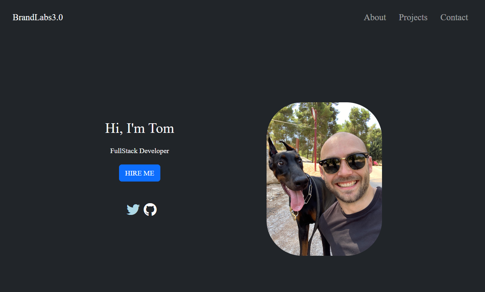

# MyReactPortfolio

## Description

Thank you for visiting my portfolio! This project was created using React, a powerful JavaScript library for building user interfaces. As a developer passionate about crafting engaging and responsive web applications, I chose React for its efficiency and flexibility. This portfolio serves as a showcase of my skills, projects, and experiences. Feel free to explore the various sections to learn more about me, my work, and the technologies I specialize in. If you have any feedback or questions, don't hesitate to reach out. Enjoy your journey through my portfolio, and I appreciate your interest in my work!

Website: [https://tjl-react-portfolio.netlify.app/](https://tjl-react-portfolio.netlify.app/)

## Installation

N/A

## Usage

N/A

## Credits

N/A

## License

N/A
